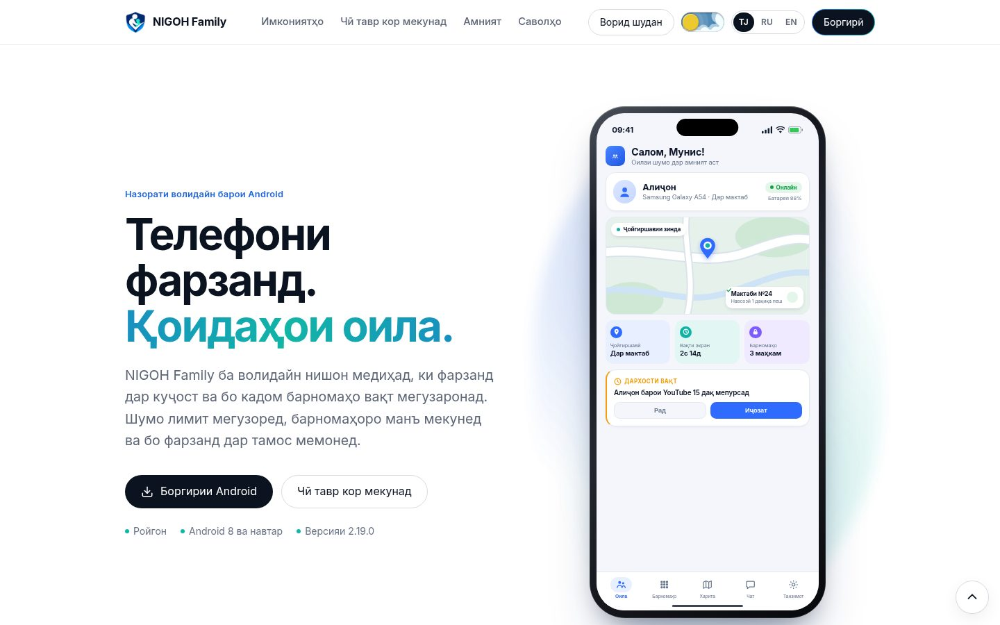
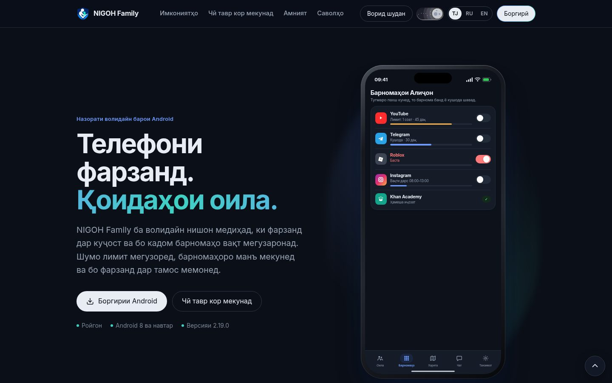
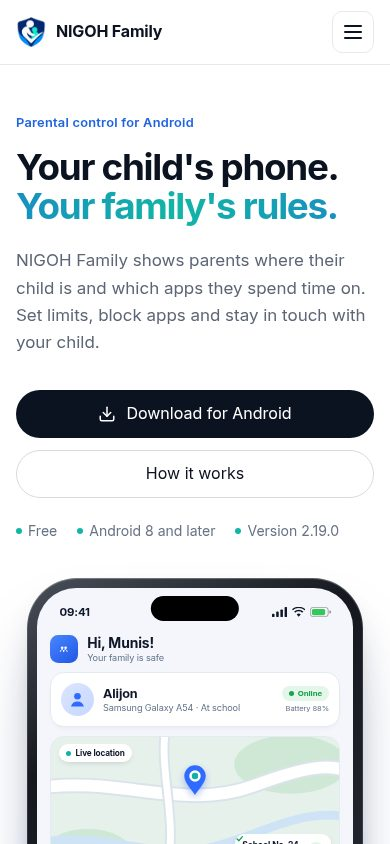
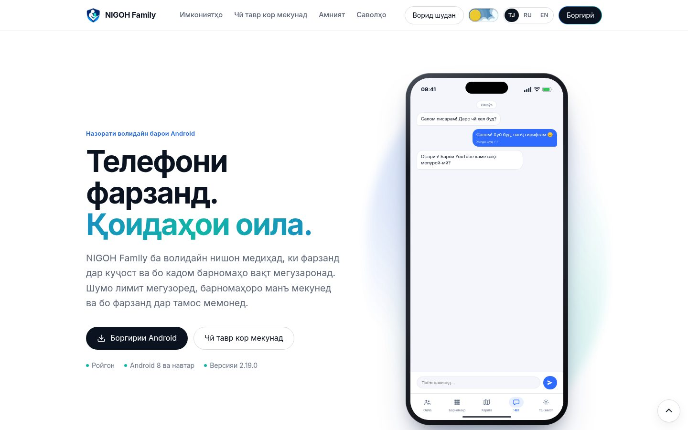
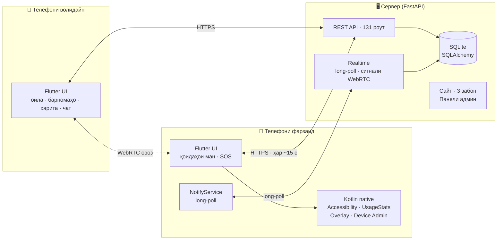

<div align="center">


# NIGOH Family

**Системаи пурраи назорати волидайн барои Android — аз сифр, бо сервери худӣ, бе Firebase.**

Барномаи мобилӣ (Flutter + Kotlin) · Сервер (FastAPI) · Сайт бо се забон · Панели админ

[](CHANGELOG.md)
[](#-роҳи-лоиҳа-24-версия-дар-14-рӯз)
[](https://github.com/anisrajabzoda09-dot/program/commits/main)
[](#-санҷишҳо)
[](https://nigohfamily.qobus.tj)

[**Сайт**](https://nigohfamily.qobus.tj) · [**Боргирии Android**](https://nigohfamily.qobus.tj/get) · [**Ҳолати сервер**](https://nigohfamily.qobus.tj/health) · [**Тағйирот**](CHANGELOG.md) · [**API**](docs/MOBILE_API.md) · [English](#-in-english)

</div>

---

<p align="center">
  
  
</p>
<p align="center"><sub>Сайти воқеӣ: дар саҳифаи аввал телефон <b>интерактивӣ</b> аст — ҷадвалҳоро пахш кунед, барномаҳоро бандед, чат нависед.</sub></p>

## 📌 Лоиҳа дар чанд сатр

NIGOH Family ба волидайн нишон медиҳад, ки фарзанд дар куҷост ва бо кадом барномаҳо вақт мегузаронад. Волидайн лимит мегузоранд, барномаҳоро манъ мекунанд, бо фарзанд чат ва занги овозӣ доранд, SOS мегиранд. Ҳамааш **дар як APK** (нақш — волидайн ё фарзанд — пас аз воридшавӣ интихоб мешавад) ва **дар сервери худӣ** — ягон хидмати бегона (Firebase, Google Cloud Messaging) лозим нест.

Лоиҳа **дар истеҳсолот кор мекунад**: [nigohfamily.qobus.tj](https://nigohfamily.qobus.tj) — бо HTTPS, навсозии автоматӣ дар телефон ва омори воқеӣ дар панели админ.

## 📊 Ҳаҷми кор бо рақамҳо

| | |
|---|---|
| **560+ коммит** | дар 14 рӯз (21.09 – 04.10.2026), 213 коммит танҳо дар як рӯз |
| **24 версияи нашршуда** | аз v1.0.0 то v2.19.0, ҳар яке бо APK-и имзошуда |
| **~23 600 сатр Dart** | барномаи Flutter (97 файл) |
| **~3 300 сатр Kotlin** | қисми native: бастани барномаҳо, хидмати огоҳиномаҳо, навсозӣ |
| **~5 600 сатр Python** | сервер: 131 роут дар 8 router |
| **~15 000 сатр HTML/CSS/JS** | сайт бо 3 забон, режими рӯз/шаб, аниматсия, демо |
| **42 файли санҷиши Flutter** | 230+ санҷиш (~7 600 сатр) |
| **7 файли санҷиши сервер** | 200+ санҷиш: API-и мобилӣ, OAuth, амният, кэш |
| **3 забон** | тоҷикӣ, русӣ, англисӣ — дар барнома, сайт ва ҳатто паёмҳои хатои сервер |
| **4 роҳи воридшавӣ** | почта/парол, Google, GitHub, Apple |

<p align="center">
  
  
</p>

## ✨ Имкониятҳо

### 👨‍👩‍👧 Волидайн
- **Барномаҳо:** рӯйхати барномаҳои фарзанд бо вақти истифода; бастан; лимити рӯзона; бастан аз рӯи категория (бозӣ, шабакаҳои иҷтимоӣ, видео); «Ҳамеша иҷозат»; бонуси вақт.
- **Ҷадвал:** «Вақти дарс», «Ҳолати танаффус», «Вақти хоб», «Тамаркузи дарс» — телефон ва SMS ҳеҷ гоҳ баста намешаванд.
- **Харита:** макони зинда, таърихи 24 соат, ҷойҳои бехатар (мактаб, хона).
- **Огоҳиномаҳо ҳатто вақте барнома пӯшида аст:** SOS бо занги хатар то хомӯш кардан, батареяи кам (<15%), телефон 20 дақ офлайн, барномаи нав, дархости вақт, занги аз даст рафта.
- **Ҳисоботи ҳафтаина**, дархостҳои вақти иловагӣ, батарея ва ҳолати дастгоҳ.

### 🧒 Фарзанд
- «Қоидаҳои ман» — фарзанд мебинад, ки чӣ баста аст ва чаро.
- Дархости вақти иловагӣ, тугмаи **SOS**, паёмҳои зуд, вақти экрани худ.
- Нест кардани барнома танҳо бо **PIN-и волидайн**.

### 🤝 Ҳарду
- Чат бо «Хонда шуд», **занги овозӣ (WebRTC)** бо экрани пурра, акси профил.
- Навсозӣ бо як тугма — бо санҷиши имзо, маълумот ва иҷозатҳо нигоҳ дошта мешаванд.
- Устоди иҷозатҳо (permissions wizard) — қадам ба қадам, бо тугма ба экрани дақиқи танзимот.

### 🌐 Сайт ва панели админ
- 3 забон (`/`, `/ru`, `/en`) бо `hreflang`, SEO, JSON-LD, sitemap.
- Режими рӯз/шаб, системаи аниматсия (бо эҳтироми `prefers-reduced-motion`), ҷустуҷӯи зинда дар FAQ, саҳифаи боргирии вобаста ба дастгоҳ бо QR.
- **Демои интерактивии барнома** дар саҳифаи аввал — 5 экран бо маълумоти намунавӣ.
- Панели админ: корбарон, дастгоҳҳо, омори боздид ва боргирӣ.

## 🏗 Меъморӣ



| Қисм | Технология |
|---|---|
| Барнома | Flutter / Dart, Kotlin (Accessibility Service, UsageStatsManager, overlay, Device Admin, foreground service), flutter_webrtc |
| Сервер | FastAPI, SQLAlchemy, SQLite, Jinja2, Uvicorn, nginx + HTTPS |
| Воридшавӣ | Сессияҳои худӣ (токен дар база танҳо SHA-256), Google OAuth, GitHub OAuth, Sign in with Apple (ES256/RS256) |
| Сайт | HTML/CSS/JS-и тоза (бе framework), компонентҳо аз uiverse.io |

### Сохтори папкаҳо

| Папка | Чӣ дорад |
|---|---|
| [`app/`](app/) | Сервер: FastAPI, моделҳо, саҳифаҳои сайт, панели админ |
| [`app/routers/`](app/routers/) | `mobile*.py` — API-и барнома; `auth.py` — OAuth; `public.py` — сайт; `admin.py` |
| [`mobile/`](mobile/) | Барномаи Android — [mobile/README.md](mobile/README.md) |
| [`tests/`](tests/) | Санҷишҳои сервер |
| [`mobile/test/`](mobile/test/) | Санҷишҳои Flutter |
| [`scripts/`](scripts/) | Нашр ба сервер (`deploy_production.py`) |
| [`deploy/`](deploy/) | nginx ва HTTPS |
| [`docs/`](docs/) | API-и мобилӣ, танзими Google / GitHub / Apple |
| [`design/`](design/) | Тарҳҳои экран, презентатсия |

Ҳар файли сервер, барнома ва сайт дар аввал шарҳи тоҷикӣ дорад, ки барои чӣ аст, ва ҳар функсия — шарҳи кӯтоҳ.

## 🛣 Роҳи лоиҳа: 24 версия дар 14 рӯз

| Версия | Сана | Чӣ илова шуд |
|---|---|---|
| **1.0.0** | 22.09 | APK-и аввал, QR барои боргирӣ |
| **2.0 – 2.2** | 23.09 | Логотип, саҳифаи асосӣ, навсозии OTA |
| **2.4 – 2.6** | 24.09 | Домени HTTPS `nigohfamily.qobus.tj`, QR-и динамикӣ, пайдо кардани APK аз чанд версия |
| **2.8 – 2.9.2** | 25–28.09 | Дастури «Restricted settings»-и Android 13/14, SEO, JSON-LD, sitemap |
| **2.9.19** | 01.10 | Хатои рӯйхати барномаҳо; сервер дигар барномаҳои қалбакӣ намесозад |
| **2.10.0** | 01.10 | **Firebase пурра хориҷ шуд** — ҳама чиз тавассути сервери худӣ; барнома ба модулҳо тақсим шуд |
| **2.11.0** | 01.10 | Макон дар дохили бино; «Қоидаҳои ман»; SOS; ҳисобот; ҷойҳои бехатар; вақти хоб |
| **2.12.0** | 01.10 | Навсозӣ бо як тугма (бо санҷиши имзо) |
| **2.13.0** | 01.10 | Огоҳиномаҳо бе Firebase, занги овозӣ WebRTC, «Тамаркузи дарс» |
| **2.14.0** | 01.10 | Устоди иҷозатҳо, аксҳои профил |
| **2.15.0** | 02.10 | Барнома ва сайт бо 3 забон; занг ва SOS дар экрани пурра |
| **2.16.0** | 02.10 | Версияи Windows (баъдтар бо қарори лоиҳа қатъ шуд) |
| **2.17.0** | 03.10 | Интерфейси равшан ва аниматсия дар ҳар экран; ҳимояи нест кардан бо PIN |
| **2.18.0** | 03.10 | Sign in with Apple; системаи ҳаракати сайт; FAQ бо ҷустуҷӯ |
| **2.19.0** | 04.10 | Sign in with GitHub; корти «App info» дар устоди иҷозатҳо; демои интерактивӣ дар саҳифаи аввал |

Тафсилоти ҳар версия: [CHANGELOG.md](CHANGELOG.md).

## 🧗 Мушкилоте, ки ҳал шуданд

Ин лоиҳа на танҳо навиштани код, балки ҷустуҷӯ ва ислоҳи мушкилоти воқеии Android ва сервер буд:

| Мушкилот | Чӣ гуна ҳал шуд |
|---|---|
| **Android 13+ иҷозати Accessibility-ро ба барномаҳои берун аз Play Store намедиҳад** («Restricted setting») | Корти махсус дар устоди иҷозатҳо: тугма ба «App info» ва 4 қадами рақамдор; дастур дар сайт |
| **Вобастагӣ аз Firebase** | Firebase пурра хориҷ шуд: воридшавӣ, маълумот ва огоҳиномаҳо ба сервери худӣ гузаронида шуданд |
| **Огоҳиномаҳо бе Firebase**, вақте барнома пӯшида аст | Хидмати native-и Kotlin бо long-poll ба сервер; SOS занги хатари такроршаванда мезанад |
| **Макони фарзанд дар дохили бино ҳеҷ гоҳ фиристода намешуд** | Мавқеи охирини маълум + муайянкунии якдафъаина ҳар дақиқа |
| **Барнома навсозии худро насб карда наметавонист** | Иҷозати `REQUEST_INSTALL_PACKAGES` намерасид — ёфта шуд; ҳоло APK пеш аз насб бо имзо санҷида мешавад |
| **Аккаунте, ки аввал волидайн буд, ҳеҷ гоҳ фарзанд шуда наметавонист** (сервер 403) | Нақш акнун ба телефон вобаста аст, на ба аккаунт |
| **Бастани барнома бояд бе интернет ҳам кор кунад** | Қоидаҳо дар телефон иҷро мешаванд; фарзанд ҳар ~15 с ҳамоҳанг мекунад |
| **Вақти хоб ва тамаркуз телефонро пурра мебастанд** | Барномаҳои телефон ва SMS ҳамеша кушода мемонанд — барои бехатарӣ |
| **Панели харита бо ҳарфҳои калони система нисфи экранро мепӯшид** | Баландӣ маҳдуд шуд ва дар дохил scroll мешавад |
| **Матни корти харита ҳар ҳарф дар як сатр** | Layout ислоҳ шуд, санҷиши 360px илова шуд |
| **APK аз маҳдудияти 100 МБ-и GitHub калон аст** | APK-ҳо берун аз git нигоҳ дошта мешаванд, сервер аз рӯйхати номзадҳо версияи охиринро меёбад |
| **Калиди имзои APK набояд ҳеҷ гоҳ иваз шавад**, вагарна телефонҳо навсозӣ намешаванд | Скрипти нашр SHA-256-и сертификатро пеш аз ҳар нашр месанҷад |
| **Пароли сервер тасодуфан дар git буд** | Файл хориҷ шуд, маълумот ба `.env.deploy`-и берун аз git гузаронида шуд |
| **Analyzer-и Dart дар роҳҳои ғайри-ASCII (кириллӣ) вайрон мешавад** | Таҳлил аз нусхаи ASCII иҷро мешавад (дар mobile/README навишта шуд) |
| **Санҷишҳои «Вақти хоб» аз соати компютер вобаста буданд** | Санҷишҳо ҳолати воқеиро аз `activeAt(now)` ҳисоб мекунанд |
| **Омори сайт ҳар саҳифаро суст мекард** (навиштан ба база дар event loop) | Омор акнун пас аз ҷавоб дар thread-и алоҳида навишта мешавад; `/ru` ва `/en` ҳам ҳисоб мешаванд |

## 🔐 Амният

- Токенҳои сессия дар база **танҳо ҳамчун SHA-256** нигоҳ дошта мешаванд.
- PIN-и волидайн; нест кардани фарзанд ва нест кардани барнома дар телефони фарзанд танҳо бо PIN; ҳимоя бо Device Admin.
- OAuth бо `state` (CSRF), GitHub — танҳо почтаи тасдиқшуда; барои телефон чиптаҳои якдафъаинаи 120-сонияӣ, ки ба nonce пайванданд.
- Apple: client secret бо ES256, санҷиши identity token бо RS256 ва калидҳои ҷамъиятии Apple.
- Сарлавҳаҳои амниятӣ: HSTS, `X-Frame-Options`, `nosniff`, `Referrer-Policy`, `Permissions-Policy`, COOP/CORP.
- Навсозӣ танҳо бо ҳамон калиди имзо насб мешавад.

## 🧪 Санҷишҳо

**Сервер** (`tests/`):

| Файл | Чӣ месанҷад |
|---|---|
| `test_mobile_v3.py` | API-и мобилӣ аз аввал то охир: сабт, оила, қоидаҳо, макон, чат, огоҳиномаҳо |
| `test_hardening.py` | health, мантиқи қатъии версия, роутҳои идораи барномаҳо |
| `test_google_oauth.py` | redirect, state-и CSRF, сессия, API-и токен |
| `test_github_auth.py` | 29 санҷиш: почтаи тасдиқшуда, пайвасти аккаунт, чиптаҳои якдафъаина |
| `test_apple_auth.py` | 25 санҷиш: ES256, RS256, пайвасти аккаунт |
| `test_perf_middleware.py` | 42 санҷиш: омор дар замина, кэши static, 3 забон |
| `test_bundle_sync.py` | ҳамоҳангсозии бастаҳо |

```bash
for t in tests/test_*.py; do venv/bin/python "$t" || break; done
```

**Барнома** (`mobile/test/`, 42 файл, 230+ санҷиш): устоди иҷозатҳо, чат, занг, харита, қоидаҳои фарзанд, ҳамоҳангсозӣ, PIN, навсозӣ, ҳар 3 забон, layout дар 360px, воридшавии GitHub/Apple.

```bash
cd mobile && flutter test
```

Илова бар ин, сайт пеш аз ҳар нашр дар браузери headless (Chrome DevTools Protocol) дар 360 / 390 / 1440px ва дар ҳарду мавзӯъ санҷида мешавад: на scroll-и уфуқӣ, на хатои JavaScript.

## 🚀 Оғози маҳаллӣ

```bash
python3 -m venv venv && venv/bin/pip install -r requirements.txt
cp .env.example .env   # арзишҳоро пур кунед
venv/bin/python run.py # http://localhost:8080
```

## 📦 Нашр (Deploy)

Маълумоти дастрасӣ ба сервер дар `.env.deploy` аст (ба git **намеравад**):

```
NIGOH_DEPLOY_HOST=…
NIGOH_DEPLOY_USER=…
NIGOH_DEPLOY_PASSWORD=…
```

```bash
# APK-ро месозад, имзоро месанҷад ва ҳамаро нашр мекунад
NIGOH_ANDROID_PROJECT=/path/to/nigoh_family_parent venv/bin/python scripts/deploy_production.py
# ё APK-и тайёрро дар app/static/downloads месанҷад ва нашр мекунад
NIGOH_SKIP_BUILD=1 venv/bin/python scripts/deploy_production.py
```

Базаи `nigoh.db`-и сервер ҳеҷ гоҳ иваз карда намешавад. Пас аз версияи нав `APP_VERSION` ва `APP_VERSION_CODE`-ро дар [`app/core/config.py`](app/core/config.py) нав кунед — барнома навсозиро ба корбарон худаш пешниҳод мекунад.

Ҳуҷҷатҳо: [API-и мобилӣ](docs/MOBILE_API.md) · [Google OAuth](docs/GOOGLE_OAUTH_SETUP.md) · [GitHub](docs/GITHUB_SIGNIN_SETUP.md) · [Apple](docs/APPLE_SIGNIN_SETUP.md)

---

## 🇬🇧 In English

**NIGOH Family** is a complete, self-hosted parental-control system for Android, built from scratch: a Flutter + Kotlin app (one APK, parent or child role chosen after sign-in), a FastAPI server with 131 routes, a trilingual website (Tajik / Russian / English) and an admin panel. It runs in production at [nigohfamily.qobus.tj](https://nigohfamily.qobus.tj) with no Firebase or third-party push service.

- **Scale:** 560+ commits and 24 signed releases (v1.0.0 → v2.19.0) in 14 days; ~23.6k lines of Dart, ~3.3k Kotlin, ~5.6k Python, ~15k HTML/CSS/JS.
- **Parents:** per-app limits and blocking, categories, school/bedtime/focus schedules, live map with 24 h history and safe places, weekly reports, extra-time requests, SOS alarm, battery/offline alerts.
- **Children:** "My rules", extra-time requests, SOS, quick messages; uninstalling needs the parent PIN.
- **Both:** chat with read receipts, WebRTC voice calls, one-tap signature-checked self-update.
- **Engineering highlights:** replaced Firebase with own long-poll notification service; worked around Android 13+ "restricted settings"; offline-first on-device blocking; Google / GitHub / Apple sign-in with CSRF state and single-use nonce-bound mobile tickets; SHA-256 session tokens; signing-certificate pinning in the deploy pipeline.
- **Tests:** 230+ Flutter tests in 42 files, server end-to-end and OAuth suites, headless-browser QA of the website at three widths in light and dark themes.

See [CHANGELOG.md](CHANGELOG.md) for every release.
