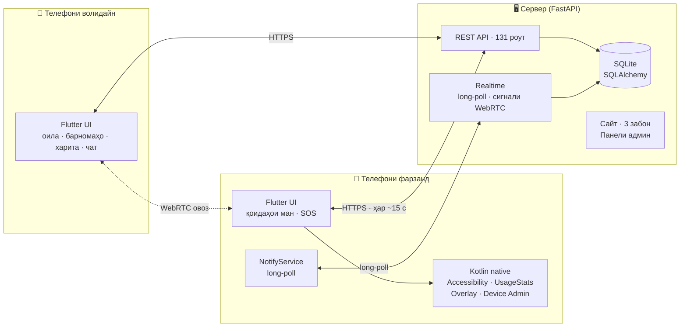

<div align="center">


# NIGOH Family

**Системаи пурраи назорати волидайн барои Android — аз сифр, бо сервери худӣ, бе Firebase.**

Барномаи мобилӣ (Flutter + Kotlin) · Сервер (FastAPI) · Сайт бо се забон · Панели админ

[](CHANGELOG.md)
[](#-роҳи-лоиҳа-26-версия-дар-15-рӯз)
[](https://github.com/anisrajabzoda09-dot/program/commits/main)
[](#-санҷишҳо)
[](https://nigohfamily.qobus.tj)

[**Сайт**](https://nigohfamily.qobus.tj) · [**Боргирии Android**](https://nigohfamily.qobus.tj/get) · [**Ҳолати сервер**](https://nigohfamily.qobus.tj/health) · [**Тағйирот**](CHANGELOG.md) · [**Чӣ гуна кор мекунад**](docs/HOW_IT_WORKS.md) · [**Ҳамаи функсияҳо**](docs/FUNCTIONS.md) · [**API**](docs/MOBILE_API.md) · [English](#-in-english)

</div>

---

Саҳифаи асосӣ версия, андоза ва дастрасии APK-ро аз файли сервер нишон медиҳад. Рамзи QR ба боргирии воқеӣ мебарад; маълумоти сохтаи оила ва омори намунавӣ намоиш дода намешаванд.

## 📌 Лоиҳа дар чанд сатр

NIGOH Family ба волидайн нишон медиҳад, ки фарзанд дар куҷост ва бо кадом барномаҳо вақт мегузаронад. Волидайн лимит мегузоранд, барномаҳоро манъ мекунанд, бо фарзанд чат ва занги овозӣ доранд, SOS мегиранд. Ҳамааш **дар як APK** (нақш — волидайн ё фарзанд — пас аз воридшавӣ интихоб мешавад) ва **дар сервери худӣ** — ягон хидмати бегона (Firebase, Google Cloud Messaging) лозим нест.

Лоиҳа **дар истеҳсолот кор мекунад**: [nigohfamily.qobus.tj](https://nigohfamily.qobus.tj) — бо HTTPS, навсозии автоматӣ дар телефон ва омори воқеӣ дар панели админ.

## 📊 Ҳаҷми кор бо рақамҳо

| | |
|---|---|
| **700+ коммит** | дар 15 рӯз (21.09 – 05.10.2026), 213 коммит танҳо дар як рӯз |
| **26 версияи нашршуда** | аз v1.0.0 то v2.21.0, ҳар яке бо APK-и имзошуда |
| **~25 400 сатр Dart** | барномаи Flutter (100+ файл) |
| **~3 900 сатр Kotlin** | қисми native: бастани барномаҳо, огоҳиномаҳо, VPN-и филтри сайтҳо, навсозӣ |
| **~7 500 сатр Python** | сервер: 160 роут дар 11 router |
| **HTML/CSS/JS** | сайт бо 3 забон ва 12 саҳифа, режими рӯз/шаб, роҳнамои насб ва маълумоти воқеии APK |
| **44 файли санҷиши Flutter** | 365 санҷиш, инчунин 9 санҷиши JUnit барои Kotlin |
| **15 файли санҷиши сервер** | 1000+ санҷиш: API, OAuth, OTP, филтр, махфият, амният, ҳамаи саҳифаҳо |
| **3 забон** | тоҷикӣ, русӣ, англисӣ — дар барнома, сайт ва ҳатто паёмҳои хатои сервер |
| **5 роҳи воридшавӣ** | почта/парол, рамз ба почта, Google, GitHub, Apple — ва ҳимояи дуқабата (Authenticator) |

## ✨ Имкониятҳо

### 👨‍👩‍👧 Волидайн
- **Барномаҳо:** рӯйхати барномаҳои фарзанд бо вақти истифода; бастан; лимити рӯзона; бастан аз рӯи категория (бозӣ, шабакаҳои иҷтимоӣ, видео); «Ҳамеша иҷозат»; бонуси вақт.
- **Ҷадвал:** «Вақти дарс», «Ҳолати танаффус», «Вақти хоб», «Тамаркузи дарс» — телефон ва SMS ҳеҷ гоҳ баста намешаванд.
- **Харита:** макони зинда, таърихи 24 соат, ҷойҳои бехатар (мактаб, хона) бо огоҳии «расид / баромад».
- **Қоидаҳо аз рӯи ҷой:** дар мактаб бозиҳо баста, Telegram 20 дақиқа, Duolingo ҳамеша кушода — телефон ҷойро аз GPS худаш муайян мекунад, бе интернет ҳам.
- **Огоҳиномаҳо ҳатто вақте барнома пӯшида аст:** SOS бо занги хатар то хомӯш кардан, батареяи кам (<15%), телефон 20 дақ офлайн, барномаи нав, дархости вақт, занги аз даст рафта.
- **Ҳисоботи ҳафтаина**, дархостҳои вақти иловагӣ, батарея ва ҳолати дастгоҳ.
- **Филтри сайтҳо аз рӯи синну сол:** «То 12 сола» ё «13–17 сола» (аз синну сол пешниҳод мешавад), SafeSearch дар Google, сайтҳои иловагии манъшуда; агар фарзанд филтрро хомӯш кунад — огоҳӣ.

### 🧒 Фарзанд
- «Қоидаҳои ман» — фарзанд мебинад, ки чӣ баста аст ва чаро.
- Дархости вақти иловагӣ, тугмаи **SOS**, паёмҳои зуд, вақти экрани худ.
- Нест кардани барнома танҳо бо **PIN-и волидайн**.

### 🤝 Ҳарду
- Чат бо «Хонда шуд», **занги овозӣ (WebRTC)** бо экрани пурра, акси профил.
- Навсозӣ бо як тугма — бо санҷиши имзо, маълумот ва иҷозатҳо нигоҳ дошта мешаванд.
- Устоди иҷозатҳо (permissions wizard) — қадам ба қадам, бо тугма ба экрани дақиқи танзимот.
- **Ҳимояи дуқабата:** рамзи Authenticator бо QR, 8 рамзи эҳтиётӣ, воридшавӣ бо рамз ба почта; қулф пас аз 5 кӯшиши нодуруст.

### 🌐 Сайт ва панели админ
- 3 забон (`/`, `/ru`, `/en`) бо `hreflang`, SEO, JSON-LD, sitemap.
- Режими рӯз/шаб, системаи аниматсия (бо эҳтироми `prefers-reduced-motion`), ҷустуҷӯи зинда дар FAQ, саҳифаи боргирии вобаста ба дастгоҳ бо QR.
- Саҳифаи асосӣ бо маълумоти воқеии APK ва QR-и боргирӣ; роҳнамои «Насб дар 3 қадам» бе экранҳо ё маълумоти сохта.
- Саҳифаҳо: сиёсати махфият, шартҳои истифода, тамос (форма бо ҳифз аз спам), маслиҳат барои волидайн (вақти экран аз рӯи синну сол), муқоисаи ростқавлона бо Google Family Link, «Чӣ нав аст».
- Панели админ: давраҳои 7/14/30/90-рӯза бо вақти Душанбе, муқоиса бо давраи пешин, графики бе маълумоти сохта, корбарон, дастгоҳҳо, версия ва роҳи боргирӣ, паёмҳо, филтрҳо ва CSV.
- Панел ҳар 60 сония дар замина нав мешавад; агар сервер ҷавоб надиҳад, маълумоти охирини дуруст гум намешавад. `/api/admin/stats/export?days=30` танҳо барои админ дастрас аст.
- «Боргирӣ» дар омор дархости муваффақи файли APK-ро нишон медиҳад; он насби анҷомёфта дар телефонро маъно намекунад. Агар APK-и ҳақиқӣ набошад, сервер `503` медиҳад ва файли қалбакӣ намесозад.

## 🏗 Меъморӣ



| Қисм | Технология |
|---|---|
| Барнома | Flutter / Dart, Kotlin (Accessibility Service, UsageStatsManager, overlay, Device Admin, foreground service), flutter_webrtc |
| Сервер | FastAPI, SQLAlchemy, SQLite, Jinja2, Uvicorn, nginx + HTTPS |
| Воридшавӣ | Сессияҳои худӣ (токен дар база танҳо SHA-256), Google OAuth, GitHub OAuth, Sign in with Apple (ES256/RS256) |
| Сайт | HTML/CSS/JS-и тоза (бе framework), компонентҳо аз uiverse.io |

### Сохтори папкаҳо

| Папка | Чӣ дорад |
|---|---|
| [`app/`](app/) | Сервер: FastAPI, моделҳо, саҳифаҳои сайт, панели админ |
| [`app/routers/`](app/routers/) | `mobile*.py` — API-и барнома; `auth.py` — OAuth; `public.py` — сайт; `admin.py` |
| [`mobile/`](mobile/) | Барномаи Android — [mobile/README.md](mobile/README.md) |
| [`tests/`](tests/) | Санҷишҳои сервер |
| [`mobile/test/`](mobile/test/) | Санҷишҳои Flutter |
| [`scripts/`](scripts/) | Нашр ба сервер (`deploy_production.py`) |
| [`deploy/`](deploy/) | nginx ва HTTPS |
| [`docs/`](docs/) | [Чӣ гуна кор мекунад](docs/HOW_IT_WORKS.md), [ҳамаи функсияҳо](docs/FUNCTIONS.md), API-и мобилӣ, танзими Google / GitHub / Apple |
| [`design/`](design/) | Тарҳҳои экран, презентатсия |

Ҳар файли сервер, барнома ва сайт дар аввал шарҳи тоҷикӣ дорад, ки барои чӣ аст, ва ҳар функсия — шарҳи кӯтоҳ.

## 🛣 Роҳи лоиҳа: 26 версия дар 15 рӯз

| Версия | Сана | Чӣ илова шуд |
|---|---|---|
| **1.0.0** | 22.09 | APK-и аввал, QR барои боргирӣ |
| **2.0 – 2.2** | 23.09 | Логотип, саҳифаи асосӣ, навсозии OTA |
| **2.4 – 2.6** | 24.09 | Домени HTTPS `nigohfamily.qobus.tj`, QR-и динамикӣ, пайдо кардани APK аз чанд версия |
| **2.8 – 2.9.2** | 25–28.09 | Дастури «Restricted settings»-и Android 13/14, SEO, JSON-LD, sitemap |
| **2.9.19** | 01.10 | Хатои рӯйхати барномаҳо; сервер дигар барномаҳои қалбакӣ намесозад |
| **2.10.0** | 01.10 | **Firebase пурра хориҷ шуд** — ҳама чиз тавассути сервери худӣ; барнома ба модулҳо тақсим шуд |
| **2.11.0** | 01.10 | Макон дар дохили бино; «Қоидаҳои ман»; SOS; ҳисобот; ҷойҳои бехатар; вақти хоб |
| **2.12.0** | 01.10 | Навсозӣ бо як тугма (бо санҷиши имзо) |
| **2.13.0** | 01.10 | Огоҳиномаҳо бе Firebase, занги овозӣ WebRTC, «Тамаркузи дарс» |
| **2.14.0** | 01.10 | Устоди иҷозатҳо, аксҳои профил |
| **2.15.0** | 02.10 | Барнома ва сайт бо 3 забон; занг ва SOS дар экрани пурра |
| **2.16.0** | 02.10 | Версияи Windows (баъдтар бо қарори лоиҳа қатъ шуд) |
| **2.17.0** | 03.10 | Интерфейси равшан ва аниматсия дар ҳар экран; ҳимояи нест кардан бо PIN |
| **2.18.0** | 03.10 | Sign in with Apple; системаи ҳаракати сайт; FAQ бо ҷустуҷӯ |
| **2.19.0** | 04.10 | Sign in with GitHub; корти «App info» дар устоди иҷозатҳо; демои интерактивӣ дар саҳифаи аввал |
| **2.20.0** | 04.10 | **Филтри сайтҳо аз рӯи синну сол** (VPN-и DNS); **ҳимояи дуқабата** (TOTP, рамзҳои эҳтиётӣ, рамз ба почта); қулфи ҳисоб; CSP ва ҳимоя аз CSRF; мӯҳлати 15-дақиқаии рамзи пайвастшавӣ; нигоҳдории маҳдуди маълумот; 6 саҳифаи нав бо 3 забон |
| **2.21.0** | 05.10 | **Қоидаҳо аз рӯи ҷой** (баста / лимит / ҳамеша кушода барои ҳар ҷой, бе интернет), огоҳии «расид / баромад» бо фосилаи эҳтиётии 40 м |

Тафсилоти ҳар версия: [CHANGELOG.md](CHANGELOG.md).

## 🧗 Мушкилоте, ки ҳал шуданд

Ин лоиҳа на танҳо навиштани код, балки ҷустуҷӯ ва ислоҳи мушкилоти воқеии Android ва сервер буд:

| Мушкилот | Чӣ гуна ҳал шуд |
|---|---|
| **Android 13+ иҷозати Accessibility-ро ба барномаҳои берун аз Play Store намедиҳад** («Restricted setting») | Корти махсус дар устоди иҷозатҳо: тугма ба «App info» ва 4 қадами рақамдор; дастур дар сайт |
| **Вобастагӣ аз Firebase** | Firebase пурра хориҷ шуд: воридшавӣ, маълумот ва огоҳиномаҳо ба сервери худӣ гузаронида шуданд |
| **Огоҳиномаҳо бе Firebase**, вақте барнома пӯшида аст | Хидмати native-и Kotlin бо long-poll ба сервер; SOS занги хатари такроршаванда мезанад |
| **Макони фарзанд дар дохили бино ҳеҷ гоҳ фиристода намешуд** | Мавқеи охирини маълум + муайянкунии якдафъаина ҳар дақиқа |
| **Барнома навсозии худро насб карда наметавонист** | Иҷозати `REQUEST_INSTALL_PACKAGES` намерасид — ёфта шуд; ҳоло APK пеш аз насб бо имзо санҷида мешавад |
| **Аккаунте, ки аввал волидайн буд, ҳеҷ гоҳ фарзанд шуда наметавонист** (сервер 403) | Нақш акнун ба телефон вобаста аст, на ба аккаунт |
| **Бастани барнома бояд бе интернет ҳам кор кунад** | Қоидаҳо дар телефон иҷро мешаванд; фарзанд ҳар ~15 с ҳамоҳанг мекунад |
| **Вақти хоб ва тамаркуз телефонро пурра мебастанд** | Барномаҳои телефон ва SMS ҳамеша кушода мемонанд — барои бехатарӣ |
| **Панели харита бо ҳарфҳои калони система нисфи экранро мепӯшид** | Баландӣ маҳдуд шуд ва дар дохил scroll мешавад |
| **Матни корти харита ҳар ҳарф дар як сатр** | Layout ислоҳ шуд, санҷиши 360px илова шуд |
| **APK аз маҳдудияти 100 МБ-и GitHub калон аст** | APK-ҳо берун аз git нигоҳ дошта мешаванд, сервер аз рӯйхати номзадҳо версияи охиринро меёбад |
| **Калиди имзои APK набояд ҳеҷ гоҳ иваз шавад**, вагарна телефонҳо навсозӣ намешаванд | Скрипти нашр SHA-256-и сертификатро пеш аз ҳар нашр месанҷад |
| **Пароли сервер тасодуфан дар git буд** | Файл хориҷ шуд, маълумот ба `.env.deploy`-и берун аз git гузаронида шуд |
| **Analyzer-и Dart дар роҳҳои ғайри-ASCII (кириллӣ) вайрон мешавад** | Таҳлил аз нусхаи ASCII иҷро мешавад (дар mobile/README навишта шуд) |
| **Санҷишҳои «Вақти хоб» аз соати компютер вобаста буданд** | Санҷишҳо ҳолати воқеиро аз `activeAt(now)` ҳисоб мекунанд |
| **Омори сайт ҳар саҳифаро суст мекард** (навиштан ба база дар event loop) | Омор акнун пас аз ҷавоб дар thread-и алоҳида навишта мешавад; `/ru` ва `/en` ҳам ҳисоб мешаванд |
| **Рамзи 6-рақамаи пайвастшавӣ мӯҳлат надошт ва `/pair` маҳдуд набуд** — 900 000 рамзро санҷида, ба фарзанди бегона пайваст шудан мумкин буд | Рамз 15 дақиқа эътибор дорад ва худкор нав мешавад; 10 кӯшиш дар 15 дақиқа барои ҳар IP ва ҳар аккаунт |
| **Филтри сайтҳо бояд дар ҳама браузерҳо кор кунад, бе root ва бе фиристодани ҳамаи трафик** | VPN-и маҳаллӣ танҳо як роҳ дорад — ба DNS; пакетҳои DNS дар Kotlin хонда мешаванд, серверҳои DoH баста мешаванд |
| **Хориҷ кардани фарзанд таърихи макон ва чатро нест намекард** — волидайни навбатӣ онро медид | `purge_child_history` ҳамаи таърихро нест мекунад; макон пас аз 30 рӯз худкор нест мешавад |
| **Пас аз тағйири қоида акси профил аз экран гум мешуд** | `_copyChild` аксҳоро нусха намекард — ислоҳ шуд ва санҷиш илова шуд |
| **Пароли сайт бе қулфи ҳисоб, админ бе 2FA, сайт бе CSP** | Қулф пас аз 5 хато, TOTP барои ҳама, CSP, тафтиши `Origin` барои POST/PUT/DELETE, `no-store` |

## 🔐 Амният

- Токенҳои сессия дар база **танҳо ҳамчун SHA-256** нигоҳ дошта мешаванд.
- PIN-и волидайн; нест кардани фарзанд ва нест кардани барнома дар телефони фарзанд танҳо бо PIN; ҳимоя бо Device Admin.
- OAuth бо `state` (CSRF), GitHub — танҳо почтаи тасдиқшуда; барои телефон чиптаҳои якдафъаинаи 120-сонияӣ, ки ба nonce пайванданд.
- Apple: client secret бо ES256, санҷиши identity token бо RS256 ва калидҳои ҷамъиятии Apple.
- Сарлавҳаҳои амниятӣ: HSTS, `X-Frame-Options`, `nosniff`, `Referrer-Policy`, `Permissions-Policy`, COOP/CORP.
- Навсозӣ танҳо бо ҳамон калиди имзо насб мешавад.
- **Ҳимояи дуқабата (TOTP, RFC 6238)** — калид бо Fernet рамзгузорӣ шудааст, зидди такрор, 8 рамзи эҳтиётии якдафъаина; рамз ба почта бо маҳдудият (10 дақ, 5 кӯшиш, 3 дар соат).
- **Қулфи ҳисоб** пас аз 5 пароли ё рамзи нодуруст (15 дақиқа); рамзи пайвастшавӣ 15 дақиқа ва 10 кӯшиш.
- **Content-Security-Policy**, ҳимоя аз CSRF (тафтиши `Origin`), `no-store` барои саҳифаҳои ҳассос.
- Нигоҳдории маҳдуд: макон 30 рӯз, IP дар омор 180 рӯз; хориҷ кардани фарзанд таърихро нест мекунад.

## 🧪 Санҷишҳо

**Сервер** (`tests/`):

| Файл | Чӣ месанҷад |
|---|---|
| `test_mobile_v3.py` | API-и мобилӣ аз аввал то охир: сабт, оила, қоидаҳо, макон, чат, огоҳиномаҳо |
| `test_hardening.py` | health, мантиқи қатъии версия, роутҳои идораи барномаҳо |
| `test_google_oauth.py` | redirect, state-и CSRF, сессия, API-и токен |
| `test_github_auth.py` | 29 санҷиш: почтаи тасдиқшуда, пайвасти аккаунт, чиптаҳои якдафъаина |
| `test_apple_auth.py` | 25 санҷиш: ES256, RS256, пайвасти аккаунт |
| `test_perf_middleware.py` | 42 санҷиш: омор дар замина, кэши static, 3 забон |
| `test_bundle_sync.py` | ҳамоҳангсозии бастаҳо |
| `test_otp.py` | 70 санҷиш: векторҳои RFC 6238, зидди такрор, рамзҳои эҳтиётӣ, қулф, рамз ба почта |
| `test_web_filter.py` | 41 санҷиш: доменҳо, танзими волидайн, ҳолати телефон, огоҳӣ |
| `test_site_pages.py` | 680+ санҷиш: ҳар саҳифа бо 3 забон — ҷавоб, hreflang, canonical, footer, sitemap |
| `test_security_headers.py` | 48 санҷиш: CSP, CSRF, no-store |
| `test_contact.py` | 49 санҷиш: форма, спам, маҳдудият, панели админ |
| `test_privacy_retention.py` | 34 санҷиш: нигоҳдории маҳдуд ва нест кардани таърих |
| `test_pairing.py` | 12 санҷиш: мӯҳлати рамз ва маҳдудияти кӯшишҳо |
| `test_place_rules.py` | 33 санҷиш: қоидаҳои ҷой, фосилаи эҳтиётӣ, огоҳии «расид / баромад» |

```bash
for t in tests/test_*.py; do venv/bin/python "$t" || break; done
```

**Барнома** (`mobile/test/`, 45 файл, 372 санҷиш): устоди иҷозатҳо, чат, занг, харита, қоидаҳои фарзанд, ҳамоҳангсозӣ, PIN, навсозӣ, филтри сайтҳо, ҳимояи дуқабата, ҳар 3 забон, layout дар 360px, воридшавии GitHub/Apple. **Kotlin:** 9 санҷиши JUnit барои пакетҳои DNS (`./gradlew :app:testDebugUnitTest`).

```bash
cd mobile && flutter test
```

Илова бар ин, сайт пеш аз ҳар нашр дар браузери headless (`scripts/qa/page_qa.mjs`, Chrome DevTools Protocol) дар 360 / 390 / 1440px ва дар ҳарду мавзӯъ санҷида мешавад: на scroll-и уфуқӣ, на хатои JavaScript, на вайронкунии CSP.

## 🚀 Оғози маҳаллӣ

```bash
python3 -m venv venv && venv/bin/pip install -r requirements.txt
cp .env.example .env   # арзишҳоро пур кунед
venv/bin/python run.py # http://localhost:8080
```

## 📦 Нашр (Deploy)

Маълумоти дастрасӣ ба сервер дар `.env.deploy` аст (ба git **намеравад**):

```
NIGOH_DEPLOY_HOST=…
NIGOH_DEPLOY_USER=…
NIGOH_DEPLOY_PASSWORD=…
```

```bash
# APK-ро месозад, имзоро месанҷад ва ҳамаро нашр мекунад
NIGOH_ANDROID_PROJECT=/path/to/nigoh_family_parent venv/bin/python scripts/deploy_production.py
# ё APK-и тайёрро дар app/static/downloads месанҷад ва нашр мекунад
NIGOH_SKIP_BUILD=1 venv/bin/python scripts/deploy_production.py
```

Базаи `nigoh.db`-и сервер ҳеҷ гоҳ иваз карда намешавад. Пас аз версияи нав `APP_VERSION` ва `APP_VERSION_CODE`-ро дар [`app/core/config.py`](app/core/config.py) нав кунед — барнома навсозиро ба корбарон худаш пешниҳод мекунад.

Ҳуҷҷатҳо: **[Чӣ гуна кор мекунад](docs/HOW_IT_WORKS.md)** · **[Ҳамаи функсияҳо](docs/FUNCTIONS.md)** · [API-и мобилӣ](docs/MOBILE_API.md) · [Google OAuth](docs/GOOGLE_OAUTH_SETUP.md) · [GitHub](docs/GITHUB_SIGNIN_SETUP.md) · [Apple](docs/APPLE_SIGNIN_SETUP.md)

---

## 🇬🇧 In English

**NIGOH Family** is a complete, self-hosted parental-control system for Android, built from scratch: a Flutter + Kotlin app (one APK, parent or child role chosen after sign-in), a FastAPI server with 131 routes, a trilingual website (Tajik / Russian / English) and an admin panel. It runs in production at [nigohfamily.qobus.tj](https://nigohfamily.qobus.tj) with no Firebase or third-party push service.

- **Scale:** 700+ commits and 26 signed releases (v1.0.0 → v2.21.0) in 15 days; ~25k lines of Dart, ~3.9k Kotlin, ~7.5k Python, ~18k HTML/CSS/JS.
- **Parents:** per-app limits and blocking, categories, school/bedtime/focus schedules, live map with 24 h history and safe places, weekly reports, extra-time requests, SOS alarm, battery/offline alerts.
- **Children:** "My rules", extra-time requests, SOS, quick messages; uninstalling needs the parent PIN.
- **Both:** chat with read receipts, WebRTC voice calls, one-tap signature-checked self-update.
- **Engineering highlights:** replaced Firebase with own long-poll notification service; worked around Android 13+ "restricted settings"; offline-first on-device blocking; Google / GitHub / Apple sign-in with CSRF state and single-use nonce-bound mobile tickets; SHA-256 session tokens; signing-certificate pinning in the deploy pipeline.
- **Rules by place:** block, limit or always allow apps per safe place (school, home), applied on the phone from GPS even offline, with arrive/leave alerts.
- **Age-based site filter:** a local DNS-only VPN on the child phone (CleanBrowsing Family/Adult, SafeSearch, DoH bypass blocked, parent alert when switched off).
- **Two-step verification:** TOTP with QR and recovery codes, email codes, account lock after 5 failures; CSP, CSRF origin checks, expiring rate-limited pairing codes, data retention limits.
- **Tests:** 365 Flutter tests, 9 JUnit tests, 1000+ server checks in 15 suites, headless-browser QA of every page at three widths in light and dark themes.
- **Docs:** [How it works](docs/HOW_IT_WORKS.md) and an auto-generated index of [every function](docs/FUNCTIONS.md).

See [CHANGELOG.md](CHANGELOG.md) for every release.
