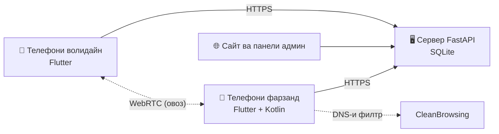
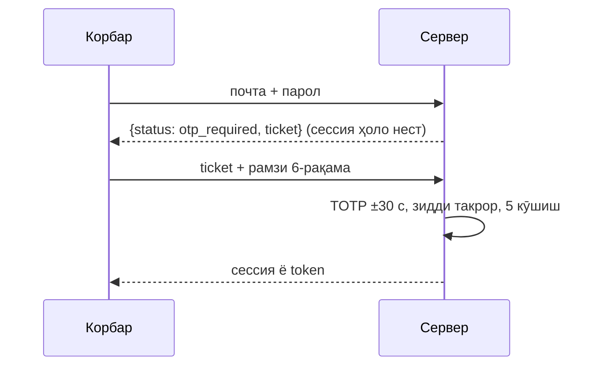
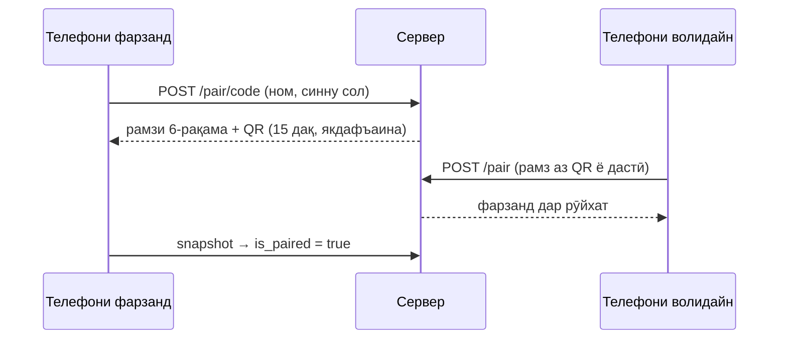
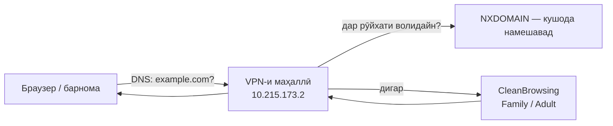

# NIGOH Family — чӣ гуна кор мекунад

Ин ҳуҷҷат мефаҳмонад, ки ҳар қисми система чӣ кор мекунад ва қисмҳо бо ҳам чӣ гуна пайваст мешаванд. Рӯйхати пурраи ҳамаи функсияҳо бо шарҳ дар [FUNCTIONS.md](FUNCTIONS.md) аст. Онро скрипт аз худи код месозад.

## Мундариҷа

1. [Се қисми система](#1-се-қисми-система)
2. [Сабти ном ва воридшавӣ](#2-сабти-ном-ва-воридшавӣ)
3. [Ҳимояи дуқабата (OTP)](#3-ҳимояи-дуқабата-otp)
4. [Пайвасти телефони фарзанд](#4-пайвасти-телефони-фарзанд)
5. [Қоидаҳо ва бастани барномаҳо](#5-қоидаҳо-ва-бастани-барномаҳо)
6. [Вақти хоб ва тамаркузи дарс](#6-вақти-хоб-ва-тамаркузи-дарс)
7. [Филтри сайтҳо аз рӯи синну сол](#7-филтри-сайтҳо-аз-рӯи-синну-сол)
8. [Макон, ҷойҳои бехатар ва батарея](#8-макон-ҷойҳои-бехатар-ва-батарея)
9. [Огоҳиномаҳо бе Firebase](#9-огоҳиномаҳо-бе-firebase)
10. [Чат, SOS ва занги овозӣ](#10-чат-sos-ва-занги-овозӣ)
11. [Навсозӣ бо як пахш](#11-навсозӣ-бо-як-пахш)
12. [Махфият ва нигоҳдории маълумот](#12-махфият-ва-нигоҳдории-маълумот)
13. [Амнияти сайт](#13-амнияти-сайт)
14. [Сайт: се забон, саҳифаҳо, тамос](#14-сайт-се-забон-саҳифаҳо-тамос)
15. [Се забон дар барнома](#15-се-забон-дар-барнома)
16. [Санҷишҳо](#16-санҷишҳо)
17. [Нашр (deploy)](#17-нашр-deploy)

---

## 1. Се қисми система

- **Сервер** (`app/`) — ягона ҷое, ки маълумот нигоҳ дошта мешавад. Роутҳо дар `app/routers/`, мантиқ дар `app/core/` ва `app/crud/`, моделҳои база дар `app/models/`.
- **Барнома** (`mobile/`) — як APK. Нақши «волидайн» ё «фарзанд» пас аз воридшавӣ интихоб мешавад ва ба телефон вобаста аст, на ба аккаунт.
- **Kotlin** (`mobile/android/.../kotlin/`) — он чизе, ки Flutter карда наметавонад: бастани барномаҳо, хидмати огоҳиномаҳо, VPN-и филтр, навсозӣ.

## 2. Сабти ном ва воридшавӣ

| Роҳ | Сайт | Барнома | Код |
|---|---|---|---|
| Почта ва парол | `POST /api/auth/login` | `POST /api/mobile/v3/auth/login` | `app/routers/auth.py`, `mobile_auth.py` |
| Google | `/auth/google/login` → callback | `POST /api/mobile/v3/auth/google` (ID token) | `app/core/mobile_auth.py` |
| GitHub | `/auth/github/login` → callback | браузер → `nigohfamily://` → чиптаи якдафъаина | `app/core/github_auth.py` |
| Apple | `/auth/apple/login` (form_post) | `POST /api/mobile/v3/auth/apple` | `app/core/apple_auth.py` |
| Рамз ба почта | `POST /api/auth/email-code` | `POST /api/mobile/v3/auth/email-code` | `app/core/otp.py` |

- Паролҳо бо **scrypt** ва salt-и ҷудогона hash мешаванд (`app/core/security.py`). Hash-ҳои кӯҳнаи SHA-256 ҳангоми воридшавии навбатӣ худкор ба scrypt гузаронида мешаванд.
- Сайт сессияро дар cookie-и `HttpOnly`, `SameSite=Lax` ва `Secure` (дар HTTPS) нигоҳ медорад. Барнома token-и `ngh_…` мегирад. Дар база танҳо SHA-256-и он нигоҳ дошта мешавад, ва мӯҳлаташ 180 рӯз аст.
- **Қулф:** пас аз 5 пароли нодуруст ҳисоб 15 дақиқа қулф мешавад. Ғайр аз ин, ҳар IP маҳдудияти дархостҳо дорад (`check_rate_limit`).

## 3. Ҳимояи дуқабата (OTP)

- **Authenticator (TOTP, RFC 6238):** калид 160 бит дорад ва дар база бо **Fernet** (`OTP_ENCRYPTION_KEY`) рамзгузорӣ мешавад. Рамз ±1 қадам (30 сония) қабул мешавад. Ҳар рамз танҳо як бор кор мекунад, чунки `totp_last_step` нигоҳ дошта мешавад.
- **Рамзҳои эҳтиётӣ:** 8 рамз ба шакли `XXXX-XXXX` сохта мешаванд, дар база танҳо SHA-256-и онҳо нигоҳ дошта мешавад, ва ҳар яке танҳо як бор кор мекунад.
- **Чипта:** пас аз пароли дуруст 5 дақиқа вақт ҳаст. Чипта ҳадди аксар 5 кӯшиш дорад, ва ҳар хато ба ҳисобкунаки ҳисоб ҳам илова мешавад.
- **Рамз ба почта:** 6 рақам, 10 дақиқа эътибор, 5 кӯшиш. Ба як почта ҳадди аксар 3 рамз дар соат фиристода мешавад, бо фосилаи на камтар аз 60 сония. Агар почта сабт нашуда бошад, ҷавоб ҳамон аст, то касе нафаҳмад, ки кадом почтаҳо сабт шудаанд. Ин имконият бе SMTP пинҳон аст.
- **Танзим:** дар сайт саҳифаи `/account/security`, дар барнома «Танзимот › Ҳимояи дуқабата». Дар панели админ, вақте 2FA хомӯш аст, огоҳӣ нишон дода мешавад.

## 4. Пайвасти телефони фарзанд

Устоди иҷозатҳо (`permissions_wizard.dart`) дар телефони фарзанд ҳар иҷозатро қадам ба қадам медиҳад: макон, огоҳиномаҳо, истифода, overlay, Accessibility, Device Admin ва батарея. Дар Android 13+ барои барномаҳое, ки аз APK насб шудаанд, корти «App info» ва 4 қадам барои «Allow restricted settings» нишон дода мешавад.

## 5. Қоидаҳо ва бастани барномаҳо

1. Телефони фарзанд рӯйхати барномаҳо ва вақти истифодаро мефиристад (`apps/sync`).
2. Волидайн қоида мегузоранд: бастан, лимити рӯзона, ҷадвал, «Ҳамеша иҷозат», бонус ё категория.
3. Фарзанд ҳар **~15 сония** snapshot мегирад (`child_sync.dart`) ва `ChildApp.toNativeRule` ҳама чизро ба як қоида ҷамъ мекунад: бонус, вақти хоб ва тамаркуз.
4. Kotlin (`AppBlockMonitorService` ва `NIGOHAccessibilityService`) барномаи кушодаро мебинад. Агар барнома баста ё вақташ тамом шуда бошад, экрани манъ (`BlockedActivity`) нишон дода мешавад.

Қоидаҳо дар худи телефон нигоҳ дошта мешаванд, барои ҳамин **бе интернет ҳам** кор мекунанд. Барномаро нест кардан танҳо бо **PIN-и волидайн** мумкин аст (`PinSecurity.kt`, Device Admin).

## 6. Вақти хоб ва тамаркузи дарс

- `Bedtime.activeAt(now)` ва `StudyMode.activeAt(now)` (`models.dart`) муайян мекунанд, ки реҷа ҳозир фаъол аст ё не. Реҷаҳое, ки аз нимашаб мегузаранд (21:30–07:00), низ дуруст ҳисоб мешаванд.
- Ҳангоми гузариш (масалан, соати 08:00) `_repushIfWindowChanged` қоидаҳоро ҳатто бе интернет аз нав ба Android мефиристад.
- Барномаҳои телефон ва SMS ҳеҷ гоҳ баста намешаванд. Дар тамаркузи дарс барномаҳои таълимӣ кушода мемонанд.

## 7. Филтри сайтҳо аз рӯи синну сол

- **Сатҳҳо:** `kids` (то 12 сола): CleanBrowsing Family. Сайтҳои калонсолон, прокси ва VPN баста мешаванд; SafeSearch ва YouTube Restricted ҳатмӣ мешаванд. `teen` (13–17 сола): CleanBrowsing Adult. Сайтҳои калонсолон баста мешаванд ва SafeSearch ҳатмӣ мешавад. Сатҳи тавсияшуда аз синну соли фарзанд муайян мешавад (`WebFilter.suggestedLevel`).
- **`WebFilterVpnService.kt`:** VPN танҳо як роҳ дорад, ки ба суроғаи DNS-и дохилӣ меравад. Барои ҳамин **трафики дигар ба VPN намеравад**. Пакетҳои DNS дар `WebFilterDns.kt` хонда мешаванд. Сайтҳое, ки волидайн бастаанд, ҷавоби NXDOMAIN мегиранд. Серверҳои DNS-over-HTTPS (dns.google, cloudflare-dns.com ва ғайра) ва `use-application-dns.net` баста мешаванд, то браузер филтрро гузарад наметавонад.
- **Розигӣ:** Android як бор тирезаи «VPN»-ро нишон медиҳад. Фарзанд дар экрани асосӣ «Иҷозат додан»-ро пахш мекунад.
- **Ҳолат:** телефон ҳолатро (`active`, `off`, `needs_permission`) ба `POST …/web-filter/state` мефиристад. Агар филтр баъди фаъол буданаш хомӯш шавад, волидайн як бор огоҳии `web_filter_off` мегиранд. `AppBlockMonitorService` филтрро ҳар дақиқа ва пас аз бозоғозии телефон барқарор мекунад.
- **Маҳдудият:** агар дар телефон «Private DNS» дастӣ гузошта шуда бошад, онро бояд хомӯш кард. Ҳеҷ филтр 100% нест.

## 8. Макон, ҷойҳои бехатар ва батарея

- Фарзанд маконро ҳар дақиқа мефиристад, ва дар дохили бино мавқеи охирини маълумро (`child_sync.dart`).
- Сервер ҳар нуқтаро дар `location_points` нигоҳ медорад. Волидайн таърихи 24 соатро мебинанд. Нуқтаҳое, ки аз **30 рӯз** кӯҳнаанд, худкор нест мешаванд (`prune_location_history`).
- **Қоидаҳо аз рӯи ҷой:** ҳар ҷой (`safe_places.rules_json`) метавонад барои ҳар барнома `block`, `limit` (10–120 дақ) ё `allow` дошта бошад. Ҷойҳо бо қоидаҳо дар snapshot ба телефон меоянд. `child_sync.updateActivePlace` ҷойро аз GPS-и худи телефон муайян мекунад (`core/geo.dart`, `placeAt`) ва ҳангоми иваз шудани ҷой қоидаҳоро аз нав ба Android мефиристад, **бе интернет ҳам**. `toNativeRule(placeRule: …)` қоидаро бо дигар реҷаҳо якҷоя мекунад: «баста» занг ва SMS-ро намебандад, аз ду лимит хурдтараш амал мекунад, «ҳамеша кушода» мисли «Ҳамеша иҷозат» аст.
- **«Расид / баромад»:** сервер ҳангоми ҳар навсозии макон `place_rules.on_location`-ро иҷро мекунад. Баромадан танҳо пас аз 40 м берун аз радиус ҳисоб мешавад, ва нуқтаҳое, ки дақиқиашон аз 150 м бадтар аст, ҷойро иваз намекунанд. Огоҳиҳои `place_arrive` ва `place_leave` танҳо барои ҷойҳое фиристода мешаванд, ки волидайн «Огоҳӣ»-ро дар онҳо фаъол кардаанд.
- Огоҳиҳо (`app/core/events.py`): батарея аз 15% паст шуд (як бор, то аз нав 20% шудан), ва телефон 20 дақиқа офлайн аст.

## 9. Огоҳиномаҳо бе Firebase

`NotifyService.kt` хидмати foreground аст, ки ба `GET /api/mobile/v3/events?after_id=…&wait=25` пайваст мемонад (long-poll). Сервер ҷавобро то 25 сония нигоҳ медорад ва ҳамон лаҳзае, ки рӯйдод пайдо шавад, бармегардонад. Ҳар навъи рӯйдод (`message`, `sos`, `time_request`, `low_battery`, `offline`, `new_app`, `call`, `web_filter_off`, `place_arrive`, `place_leave`) бо забони корбар нишон дода мешавад (`NotifyStrings.kt`). SOS занги хатари такроршаванда мезанад, то волидайн онро хомӯш кунанд.

## 10. Чат, SOS ва занги овозӣ

- Чат: `chat_messages` бо «Хонда шуд» (`/chat/read`). SOS паёми навъи `urgent` аст ва ба волидайн рӯйдоди `sos` мефиристад.
- Занг: сервер танҳо сигналҳоро мерасонад (`/api/mobile/v3/calls/*`: offer, answer, ice). Худи овоз мустақим байни телефонҳо бо **WebRTC** меравад ва сабт намешавад. Занге, ки дар 45 сония ҷавоб нагирад, «аз даст рафта» ҳисоб мешавад.

## 11. Навсозӣ бо як пахш

Сервер дар `/api/mobile/...` версияи охиринро (`APP_VERSION`, `APP_VERSION_CODE`) ва пайванди APK-ро медиҳад. `AppUpdater.kt` APK-ро боргирӣ мекунад, **имзоро месанҷад** (ҳамон сертификат бояд бошад) ва насбро оғоз мекунад. Маълумот ва иҷозатҳо мемонанд. Скрипти нашр APK-еро, ки бо сертификати дигар имзо шудааст, қабул намекунад (SHA-256 `d4d3e4fa…`).

## 12. Махфият ва нигоҳдории маълумот

| Маълумот | Мӯҳлат | Код |
|---|---|---|
| Таърихи макон | 30 рӯз | `prune_location_history` |
| IP ва браузер дар омори сайт | 180 рӯз, баъд пок мешавад | `anonymize_site_analytics` |
| Таърихи фарзанд ҳангоми хориҷ кардан | фавран нест мешавад | `purge_child_history` |
| Ҳамаи маълумоти фарзанд (панели админ) | фавран | `delete_child_data` |
| Token-и барнома | 180 рӯз | `app/core/mobile_auth.py` |

Омори саҳифаҳо **пас аз** ҷавоб дар thread-и алоҳида навишта мешавад, то сайт суст нашавад (`_log_page_view`).

## 13. Амнияти сайт

Ҳар ҷавоб аз `security_and_analytics_middleware` (`app/main.py`) мегузарад:

- **CSP:** танҳо манбаъҳое иҷозат доранд, ки сайт воқеан истифода мебарад. `object-src 'none'`, `base-uri 'self'` ва `frame-ancestors 'self'` гузошта шудаанд.
- **CSRF:** POST, PUT, PATCH ва DELETE бо `Origin`-и бегона 403 мегиранд. Истисно танҳо бозгашти Apple аст.
- **no-store:** `/admin`, `/account` ва API-ҳои воридшавӣ ва барнома дар кэш нигоҳ дошта намешаванд.
- HSTS, `nosniff`, `X-Frame-Options`, `Referrer-Policy` ва `Permissions-Policy` (камера ва макон хомӯш).
- Формаи тамос: майдони пинҳон (honeypot) ва ҳадди аксар 5 паём аз як IP дар як соат.

## 14. Сайт: се забон, саҳифаҳо, тамос

- Тоҷикӣ дар `/`, русӣ дар `/ru`, англисӣ дар `/en`. Ҳар саҳифа файли худро барои ҳар забон дорад (`app/templates/site/`, `site/ru/`, `site/en/`), бо `hreflang` ва `canonical`.
- `sitemap.xml` аз рӯйхати саҳифаҳо худкор сохта мешавад (`build_sitemap`).
- «Чӣ нав аст» аз `app/core/releases.py` сохта мешавад. Паёмҳои формаи тамос дар `contact_messages` нигоҳ дошта мешаванд ва дар панели админ дар бахши «Паёмҳо» намоёнанд.
- Демои интерактивии барнома дар саҳифаи аввал (`_demo_phone.html`, `demo.js`) ва аниматсияи «Насб дар 3 қадам» (`_install_anim.html`) бе ягон китобхона, бо CSS ва JavaScript-и тоза сохта шудаанд.

## 15. Се забон дар барнома

`tr('матни тоҷикӣ')` калидро дар луғатҳои `strings_core.dart`, `strings_parent.dart` ва `strings_child.dart` меҷӯяд ва тарҷумаи русӣ ё англисиро бармегардонад. Санҷиши `l10n_all_test.dart` ҳар `tr()`-и навро, ки тарҷума надорад, хато медонад. Сервер паёмҳои хаторо аз рӯи сарлавҳаи `X-NIGOH-Lang` тарҷума мекунад (`app/core/i18n.py`).

## 16. Санҷишҳо

| Куҷо | Чӣ | Фармон |
|---|---|---|
| `tests/` | 13 файл: API аз аввал то охир, OAuth, OTP, филтр, махфият, амният, ҳамаи саҳифаҳо | `for t in tests/test_*.py; do venv/bin/python $t; done` |
| `mobile/test/` | 365+ санҷиши Flutter | `cd mobile && flutter test` |
| `mobile/android/app/src/test/` | JUnit барои пакетҳои DNS | `./gradlew :app:testDebugUnitTest` |
| `scripts/qa/page_qa.mjs` | браузер: хатоҳои JS, CSP, scroll-и уфуқӣ, скриншот | `node scripts/qa/page_qa.mjs http://127.0.0.1:8080 /tmp/qa / /faq` |
| `scripts/gen_function_docs.py --check` | `FUNCTIONS.md` бо код мувофиқ аст | — |

## 17. Нашр (deploy)

`scripts/deploy_production.py`:
1. Агар `NIGOH_SKIP_BUILD` набошад, APK-ро месозад.
2. Имзои APK-ро месанҷад (v2 ва v3, на debug, SHA-256 бояд бо сертификати релизӣ мувофиқ бошад).
3. `app/`-ро бо rsync ба сервер мефиристад. `nigoh.db` ҳеҷ гоҳ иваз карда намешавад.
4. Вобастагиҳоро насб мекунад ва хидматро аз нав оғоз мекунад.

Калидҳо ва паролҳо танҳо дар `.env`-и сервер ва `.env.deploy`-и маҳаллӣ ҳастанд (ҳарду берун аз git): Google, GitHub, Apple, `OTP_ENCRYPTION_KEY` ва SMTP.
